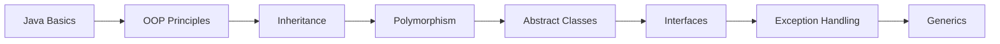

<div align="center">

# 🦁 Zoo Management System 🐘

### *A Comprehensive Java Learning Journey*

[](https://www.java.com/)
[](https://github.com/tirtir45)
[](https://esprit.tn/)

</div>

---

## 📖 About

A comprehensive Java application for managing zoo operations, developed through **8 progressive prosit exercises** at **Esprit**. This project demonstrates the evolution from basic Java concepts to advanced Object-Oriented Programming principles.

## 🎯 Description

This project is a learning-based system designed to practice Java programming concepts by simulating real-world zoo management operations. Each prosit (exercise) builds upon the previous one, progressively adding features and complexity - from simple input/output to advanced topics like generics and custom exceptions.

---

## ✨ Features

| Feature | Description |
|---------|-------------|
| 🐾 **Animal Management** | Add, update, and remove animals with validation |
| 🏛️ **Zoo Tracking** | Monitor zoo information and capacity |
| 🔒 **Cage Management** | Handle enclosures with maximum capacity limits |
| 🦒 **Animal Hierarchy** | Aquatic (Dolphins, Penguins) and Terrestrial animals |
| 🍖 **Dietary System** | Carnivore, Herbivore, and Omnivore interfaces |
| ⚠️ **Exception Handling** | Custom exceptions for validation and error management |

---

## 🛠️ Technologies Used

<div align="center">


</div>

- **Language:** Java
- **Paradigm:** Object-Oriented Programming (OOP)
- **Concepts:** Encapsulation, Inheritance, Polymorphism, Abstraction, Interfaces, Generics

---

## 📂 Project Structure

```
zoo-management/
│
├── 📦 tn.esprit.gestionzoo.main/
│   └── ZooManagement.java
│
├── 📦 tn.esprit.gestionzoo.entities/
│   ├── Animal.java
│   ├── Zoo.java
│   ├── Aquatic.java
│   ├── Terrestrial.java
│   ├── Dolphin.java
│   ├── Penguin.java
│   └── Food.java (enum)
│
├── 📦 tn.esprit.gestionzoo.interfaces/
│   ├── Carnivore.java
│   ├── Herbivore.java
│   └── Omnivore.java
│
└── 📦 tn.esprit.gestionzoo.exceptions/
    ├── ZooFullException.java
    └── InvalidAgeException.java
```

---

## 📚 Prosits Completed

<details>
<summary><b>📝 Prosit 1: Project Setup & Basic Input</b></summary>

- ✅ Created `ZooManagement` class with basic attributes
- ✅ Implemented user input using Scanner
- ✅ Input validation for zoo name and number of cages

</details>

<details>
<summary><b>🏗️ Prosit 2: Object-Oriented Foundation</b></summary>

- ✅ Created `Animal` and `Zoo` classes
- ✅ Implemented parameterized constructors
- ✅ Added `displayZoo()` method
- ✅ Overrode `toString()` method for proper object display

</details>

<details>
<summary><b>⚙️ Prosit 3: Core Zoo Operations</b></summary>

- ✅ Implemented `addAnimal()` method with duplicate prevention
- ✅ Created `searchAnimal()` method for finding animals by name
- ✅ Added `removeAnimal()` functionality
- ✅ Made `nbrCages` a constant (max 25 animals)
- ✅ Implemented `isZooFull()` validation
- ✅ Created `comparerZoo()` to compare two zoos

</details>

<details>
<summary><b>🔐 Prosit 4: Encapsulation & Organization</b></summary>

- ✅ Applied encapsulation (private attributes with getters/setters)
- ✅ Added validation (no negative age, non-empty zoo name)
- ✅ Organized code into packages: `tn.esprit.gestionzoo.main` and `tn.esprit.gestionzoo.entities`

</details>

<details>
<summary><b>🌳 Prosit 5: Inheritance - Animal Types</b></summary>

- ✅ Created animal hierarchy: `Aquatic` and `Terrestrial` classes
- ✅ Implemented `Dolphin` (swimming speed) and `Penguin` (swimming depth) subclasses
- ✅ Added parameterized constructors with inheritance
- ✅ Overrode `toString()` in subclasses
- ✅ Implemented `swim()` method with polymorphism

</details>

<details>
<summary><b>🐬 Prosit 6: Advanced Aquatic Management</b></summary>

- ✅ Added `aquaticAnimals` array in Zoo class
- ✅ Implemented `addAquaticAnimal()` method
- ✅ Created `maxPenguinSwimmingDepth()` to find deepest diver
- ✅ Added `displayNumberOfAquaticsByType()` for statistics
- ✅ Overrode `equals()` method for Aquatic animals
- ✅ Made `swim()` abstract for mandatory implementation

</details>

<details>
<summary><b>⚠️ Prosit 7: Exception Handling</b></summary>

- ✅ Created custom exception `ZooFullException`
- ✅ Modified `addAnimal()` to throw exceptions instead of returning boolean
- ✅ Implemented `InvalidAgeException` for age validation
- ✅ Added proper try-catch blocks in main method

</details>

<details>
<summary><b>🔧 Prosit 8: Interfaces & Generics</b></summary>

- ✅ Created generic interfaces: `Carnivore<T>`, `Herbivore<T>`, and `Omnivore<T>`
- ✅ Implemented `Food` enum (MEAT, PLANT, BOTH)
- ✅ Applied `Carnivore` interface to `Aquatic` class
- ✅ Applied `Omnivore` interface to `Terrestrial` class
- ✅ Tested dietary methods with different animal types

</details>

---

## 🎓 Learning Objectives



- 📌 Object-Oriented Programming principles
- 📌 Java collections and data structures
- 📌 Class inheritance and polymorphism
- 📌 Abstract classes and interfaces
- 📌 Exception handling and custom exceptions
- 📌 Generic programming

---

## 💡 Key Concepts Demonstrated

| Concept | Implementation |
|---------|----------------|
| **Encapsulation** | Private attributes with getters/setters |
| **Inheritance** | Animal → Aquatic/Terrestrial → Dolphin/Penguin |
| **Polymorphism** | Method overriding (`swim()`, `toString()`) |
| **Abstraction** | Abstract methods in `Aquatic` class |
| **Interfaces** | `Carnivore`, `Herbivore`, `Omnivore` |
| **Exception Handling** | Custom exceptions for validation |
| **Generics** | Generic interfaces with type parameters |

---


## 📝 Notes

> 💼 This is a class project developed at **Esprit** as part of the Java programming curriculum.  
> 🎯 Each prosit builds progressively on previous concepts, creating a comprehensive learning experience.

---

## 🤝 Contributing

Contributions, issues, and feature requests are welcome!  
Feel free to check the [issues page](https://github.com/tirtir45/Java/issues).

---

## 👩‍💻 Author

<div align="center">

### **Rym Ben Hmida**

[](https://github.com/tirtir45)
[](https://www.linkedin.com/in/rym-ben-hmida-9a41a730a)

</div>

---

## 👨‍🏫 Instructor

<div align="center">

**Ghassen Klai**  
</div>

---

<div align="center">

### 🎓 *Developed at Esprit - Learning through Prosits* 

**Made with ❤️ and ☕ by Rym Ben Hmida**

</div>
